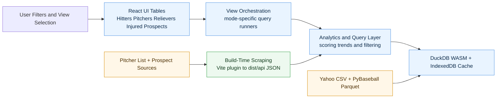

# Fantasy Baseball Eval

**[Live App](https://mccomark21.github.io/yahoo-fantasy-baseball-eval-app/)**

A browser-based tool for evaluating **hitters, starting pitchers, relievers, and prospects** across Yahoo Fantasy Baseball leagues. It blends Yahoo roster data, StatCast-derived batter metrics from [PyBaseball](https://github.com/jldbc/pybaseball), [Pitcher List](https://pitcherlist.com/) rankings, and multi-source minor league prospect data, all processed client-side with [DuckDB WASM](https://duckdb.org/docs/api/wasm/overview) and static assets.


## App Views

### Hitters

- League, fantasy team, and position filters (league is always selected)
- Time windows: Season-to-Date, Last 30 Days, Last 14 Days, Last 7 Days
- Volume threshold filter: minimum PA and BBE set to 50% of the filtered-group medians
- Z-score normalization for xwOBA, BB:K, Pull Air%, and SB
- PA acts as a **confidence multiplier** on the STD composite: players below cohort-mean PA have their composite scaled down proportionally (capped at 1.0 — no bonus for above-average PA)
- Composite score sorting (default):
	- xwOBA: 40%
	- BB:K: 30%
	- Pull Air%: 20%
	- SB: 10%
	- PA Confidence Multiplier: `min(1.0, player_PA / cohort_mean_PA)` applied after blending
- Z-scores are clamped to +/-2.5 to reduce outlier impact

### Pitchers

- Uses latest Pitcher List Top 100 starting pitcher rankings
- Displays separate trend columns:
	- **This Week**: weekly article movement badge (`up`/`down`/`same`/`new`)
	- **Trend (8W)**: compact rank sparkline from the latest 8 weekly snapshots
- Supports league/team filtering to focus available or rostered arms

### Relievers

- Uses Pitcher List reliever rankings in two scoring modes:
	- `svhld` (saves + holds)
	- `saves`
- Scoring mode is inferred from league name (with `svhld` fallback when unmatched)
- Displays the same split trend model as SP rankings:
	- **This Week** badge for weekly article movement
	- **Trend (8W)** sparkline for multi-week rank direction

### Injured Pitchers

- Combines SP and RP article sections titled **"Injured Pitchers Who Will Be Considered When Healthy"**
- Shows relative rank when healthy, role (`SP` or `RP`), team context, and injury notes
- Supports the same league/team filtering and player search workflow

### Prospects

- Aggregates prospect rankings from MLB Pipeline, FanGraphs, Prospects Live, FantraxHQ, Pitcher List, and TJStats into a single consensus list
- Displays a freshness-weighted consensus rank, highest/lowest rank, and rank standard deviation across sources
- Uses each source's last updated date when available, with an exponential decay curve so newer rankings carry more influence without fully discarding older lists
- Bias-adjusted best-rank score surfaces prospects with strong high-end rankings
- Org column is normalized to MLB team abbreviations (for example, `LAD`, `NYY`, `BOS`)
- POS column is reduced to a single display value; pitchers prefer handedness (`LHP`/`RHP`) and otherwise fall back to `SP` or `P`
- Shows minor league stats (AB, AVG, HR, IP, ERA, WHIP, K/9) in selectable windows: Season, L30, L14, L7
- Uses guarded fallback name repair when prospect stat rows contain replacement-character mojibake (for example, `Pe�a`) so rows still join to the correct player
- **Trend emoji indicators** show performance across three windows simultaneously:
  - Display order: `[L7] [14] [L30]` — one emoji per window
  - `🔥` Hot — strong recent performance (see thresholds below)
  - `🧊` Ice — poor recent performance
  - `➖` Neutral — insufficient volume or performance within normal range
	- Trend sorting is recency-weighted, so `L7` drives ordering more than `L14`, which drives ordering more than `L30`
  - **Hitter thresholds (OPS-based):** 🔥 OPS ≥ .900 | 🧊 OPS ≤ .550 (L7) / ≤ .600 (L14/L30) — min AB: 10 (L7), 30 (L14), 60 (L30)
	- **Pitcher thresholds (composite score):** Score = `(2.50/ERA)×40 + (0.90/WHIP)×35 + (K9/9.0)×25` — 🔥 score ≥ 85 | 🧊 score ≤ 50 (L7) / ≤ 55 (L14/L30) — min IP: 3 (L7), 6 (L14), 12/12 (L30 fire/ice)
- Hover any trend cell for a per-window tooltip showing AB/OPS or IP/score
- Roster status badge indicates whether the prospect is currently rostered in your league
- Prospects without a Yahoo ownership match are labeled as Free Agent so team filters do not hide them
- Optional ranking columns toggle (MLB rank, FG rank, Prospects Live rank)

## Data Pipeline

The app joins Yahoo and PyBaseball data in-browser and enriches pitcher views with Pitcher List ranking snapshots.

| Source | Format | Repository |
|--------|--------|------------|
| **Yahoo Fantasy Rosters** — league name, fantasy team, player name, MLB team, eligible positions | CSV | [mccomark21/yahoo-fantasy-data-hub](https://github.com/mccomark21/yahoo-fantasy-data-hub) |
| **PyBaseball Batter Game Logs** — per-game StatCast metrics (xwOBA, batted-ball data, plate discipline, etc.) | Parquet | [mccomark21/pybaseball-data-hub](https://github.com/mccomark21/pybaseball-data-hub) |
| **Pitcher List Rankings** — latest starting pitcher, reliever, injured-pitcher, and prospect ranking tables | HTML -> JSON | [pitcherlist.com](https://pitcherlist.com/) |
| **Prospect Rankings** — MLB Pipeline, FanGraphs, Prospects Live, FantraxHQ, Pitcher List, and TJStats rankings with source freshness metadata | HTML/JSON -> JSON | [mlb.com](https://www.mlb.com/), [fangraphs.com](https://www.fangraphs.com/), [prospectslive.com](https://www.prospectslive.com/), [fantraxhq.com](https://fantraxhq.com/), [pitcherlist.com](https://pitcherlist.com/), [tjstats.ca](https://tjstats.ca/) |

The Yahoo and PyBaseball source files are fetched at startup and cached in **IndexedDB** with a 4-hour TTL to avoid redundant downloads on page reload.

Yahoo roster data is additionally constrained to same-local-day cache reuse, so manager moves are picked up daily even if the app is reloaded frequently throughout the day.

Yahoo hitter rows are deduplicated by player within each league (keeping the latest source row) so cross-league membership does not suppress league-specific hitter visibility.

## System Architecture



The runtime path is left-to-right: user input drives view orchestration, queries run against DuckDB with cached source data, and results render in the active table. Ranking feeds come from build-time scraping in production and Vite middleware during local development.

## Build and Runtime API Behavior

The app uses different ranking data behavior in local development versus production hosting:

- **Local development (`npm run dev`)**
	- Vite middleware serves live scrape endpoints:
		- `/api/pitcher-list/latest`
		- `/api/pitcher-list/history`
		- `/api/relief-list/latest?scoring=svhld|saves`
		- `/api/relief-list/history?scoring=svhld|saves`
		- `/api/injured-pitchers/latest`

- **Production build (`npm run build`)**
	- A Vite build plugin scrapes and writes static snapshots to:
		- `dist/api/pitcher-list/latest.json`
		- `dist/api/pitcher-list/history.json`
		- `dist/api/relief-list/latest.svhld.json`
		- `dist/api/relief-list/latest.saves.json`
		- `dist/api/relief-list/history.svhld.json`
		- `dist/api/relief-list/history.saves.json`
		- `dist/api/injured-pitchers/latest.json`
		- `dist/api/prospects/latest.json`
	- The client reads these static JSON assets in production (GitHub Pages compatible)
	- Pitcher/reliever history snapshots are retained as a rolling 12-snapshot series for trend rendering

### Scheduled Refresh Cadence (Production)

- **Starting pitcher rankings** refresh weekly on Tuesday mornings (ET)
- **Relief pitcher rankings** refresh weekly on Friday mornings (ET)
- **Yahoo roster CSV data** refreshes daily in-app (same-local-day cache policy)

## Key Features

- **Three-mode workflow** — evaluate Hitters, Pitchers, and Relievers in one app
- **Multi-league support** — switch between Yahoo leagues to evaluate different player pools
- **Default roster focus** — defaults to Free Agent teams when available (across Hitters, Pitchers, Relievers, and Prospects)
- **Sortable data tables** — sort by any visible column
- **Theme toggle** — light/dark theme persisted via local storage
- **Responsive UI** — optimized for desktop and mobile usage
- **Accuracy cohort testing** — background automated tests for reproducible xwOBA validation cohorts

### Hitter Metrics

| Stat | Description |
|------|-------------|
| **PA** | Plate Appearances |
| **BBE** | Batted Ball Events (balls put in play) |
| **xwOBA** | Expected Weighted On-Base Average (StatCast) |
| **Pull Air%** | Percentage of batted balls pulled or hit in the air |
| **BB:K** | Walk-to-Strikeout ratio |
| **SB** | Stolen Bases |
| **PA Adj Z** | PA z-score shown for context; PA acts as a confidence multiplier on the STD composite (penalty for below-average PA, no bonus for above-average PA) |

Each metric has a z-score column that normalizes values within the current filtered group. The STD composite is a weighted quality blend multiplied by a PA confidence factor.

| Metric | Weight / Role |
|--------|---------------|
| xwOBA | 40% (quality blend) |
| BB:K | 30% (quality blend) |
| Pull Air% | 20% (quality blend) |
| SB | 10% (quality blend) |
| PA | `min(1.0, player_PA / cohort_mean_PA)` — multiplier, not additive |

Z-scores are clamped to ±2.5 to prevent outliers from dominating the composite. The table sorts by composite score (descending) by default.

## Tech Stack

- **React 19** + **TypeScript** — UI framework
- **Vite 8** — build and dev tooling
- **DuckDB WASM** — in-browser SQL engine for joining and aggregating data
- **TanStack Table v8** — headless table with sorting
- **Tailwind CSS** + **shadcn/ui** — styling and component library
- **Cheerio** — HTML parsing for ranking snapshot generation

## Getting Started

```bash
# Install dependencies
npm install

# Start the dev server
npm run dev

# Build for production
npm run build

# Preview the production build locally
npm run preview
```

## Available Scripts

- `npm run dev` - start local dev server with live ranking middleware endpoints
- `npm run build` - create production build and generate static ranking snapshots in `dist/api`
- `npm run lint` - run ESLint
- `npm run preview` - preview the production build locally

## Deployment

The app is configured for **GitHub Pages**. The base path is set in `vite.config.ts`:

```ts
base: '/yahoo-fantasy-baseball-eval-app/'
```

Because GitHub Pages is static hosting, ranking data is generated at build time into static JSON under `dist/api/*`. In local development, Vite middleware routes still provide live scraping.

GitHub Actions uses two scheduled deploy workflows:

- Tuesday schedule: deploy build with `RANKING_REFRESH_TARGET=pitcher`
- Friday schedule: deploy build with `RANKING_REFRESH_TARGET=relief`

During targeted refreshes, non-target snapshot files are carried forward from the currently deployed JSON assets so only the intended ranking source is refreshed.

Push the built output (from `npm run build`) to the `gh-pages` branch or configure GitHub Actions to deploy automatically.

## License

This project is licensed under the [MIT License](LICENSE).
