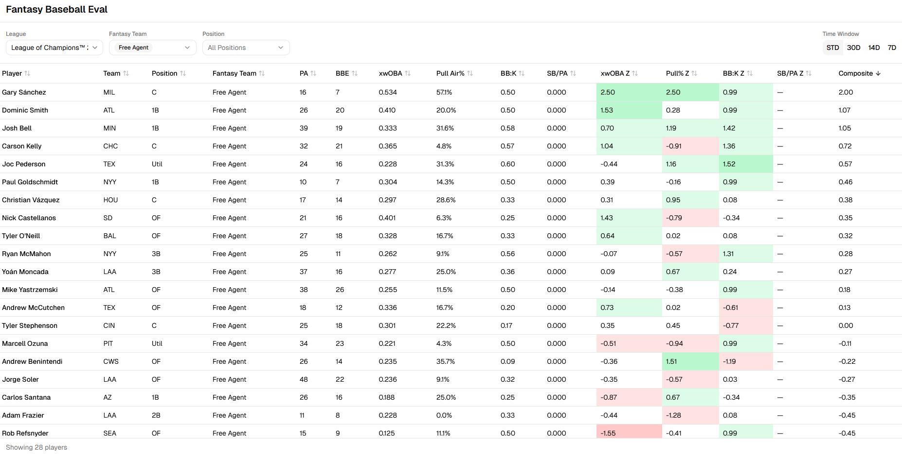

# Fantasy Baseball Eval

**[Live App](https://mccomark21.github.io/yahoo-fantasy-baseball-eval-app/)**

A browser-based tool for evaluating hitters across Yahoo Fantasy Baseball leagues. It blends league roster data from Yahoo with StatCast advanced metrics sourced via [PyBaseball](https://github.com/jldbc/pybaseball), all processed in-browser using [DuckDB WASM](https://duckdb.org/docs/api/wasm/overview)—no backend required.



## Data Sources

The app pulls from two companion data repositories and joins them in-browser:

| Source | Format | Repository |
|--------|--------|------------|
| **Yahoo Fantasy Rosters** — league name, fantasy team, player name, MLB team, eligible positions | CSV | [mccomark21/yahoo-fantasy-data-hub](https://github.com/mccomark21/yahoo-fantasy-data-hub) |
| **PyBaseball Batter Game Logs** — per-game StatCast metrics (xwOBA, batted-ball data, plate discipline, etc.) | Parquet | [mccomark21/pybaseball-data-hub](https://github.com/mccomark21/pybaseball-data-hub) |

Both files are fetched at startup and cached in **IndexedDB** with a 4-hour TTL to avoid redundant downloads on page reload.

## Key Features

- **Multi-league support** — switch between Yahoo leagues to evaluate different player pools
- **Roster filtering** — filter by fantasy team and eligible position; defaults to Free Agents and Waiver wire players
- **Time window toggles** — view stats for Season-to-Date, Last 30 Days, Last 14 Days, or Last 7 Days
- **Volume thresholds** — automatically excludes low-volume hitters using a minimum PA/BBE cutoff (50% of the group median)
- **Sortable stat table** — click any column header to sort

### Metrics

| Stat | Description |
|------|-------------|
| **PA** | Plate Appearances |
| **BBE** | Batted Ball Events (balls put in play) |
| **xwOBA** | Expected Weighted On-Base Average (StatCast) |
| **Pull Air%** | Percentage of batted balls pulled or hit in the air |
| **BB:K** | Walk-to-Strikeout ratio |
| **SB/PA** | Stolen Bases per Plate Appearance |

Each metric also has a **z-score** column that normalizes the stat relative to the current filtered group. A **Composite Score** combines the z-scores with fixed weights:

| Metric | Weight |
|--------|--------|
| xwOBA | 40% |
| BB:K | 30% |
| Pull Air% | 20% |
| SB/PA | 10% |

Z-scores are clamped to ±2.5 to prevent outliers from dominating the composite. The table sorts by composite score (descending) by default.

## Tech Stack

- **React 19** + **TypeScript** — UI framework
- **Vite** — build tooling
- **DuckDB WASM** — in-browser SQL engine for joining and aggregating data
- **TanStack Table v8** — headless table with sorting
- **Tailwind CSS** + **shadcn/ui** — styling and component library

## Getting Started

```bash
# Install dependencies
npm install

# Start the dev server
npm run dev

# Build for production
npm run build

# Preview the production build locally
npm run preview
```

## Deployment

The app is configured for **GitHub Pages**. The base path is set in [`vite.config.ts`](vite.config.ts):

```ts
base: '/yahoo-fantasy-baseball-eval-app/'
```

Push the built output (from `npm run build`) to the `gh-pages` branch or configure GitHub Actions to deploy automatically.

## License

This project is licensed under the [MIT License](LICENSE).
